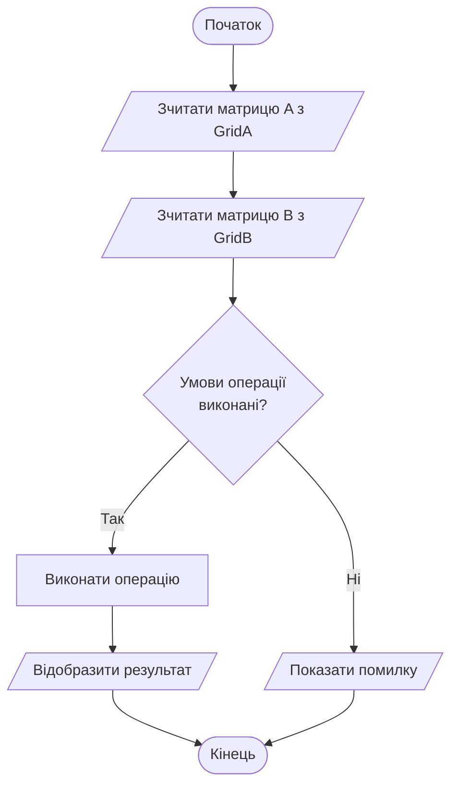
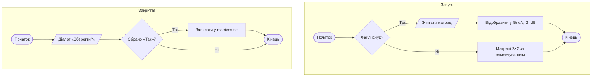

# MatrixApp — Калькулятор матриць

WPF-додаток на C# / .NET 8 для виконання операцій над матрицями.
Курсовий проект з дисципліни «Програмна технологія .NET».

## Можливості

- Додавання, віднімання та множення матриць довільного розміру (до 10×10)
- Автоматичне завантаження матриць при запуску з файлу `matrices.txt`
- Запит про збереження при закритті програми
- Ручне збереження та завантаження через кнопки
- Відображення детальних повідомлень про помилки (несумісні розміри тощо)
- Автоматичні тести методів класу `MatrixModel`

## Структура проекту
MatrixApp/
├── Matrix/
│   ├── Matrix.cs              # Клас MatrixModel — основна логіка операцій
│   ├── MatrixGridHelper.cs    # Конвертація DataTable ↔ MatrixModel
│   ├── MatrixFileService.cs   # Збереження та завантаження з файлу
│   ├── MainWindow.xaml        # Розмітка головного вікна
│   └── MainWindow.xaml.cs     # Логіка головного вікна
└── Matrix.Tests/
└── Test1.cs               # Автоматичні тести
## Запуск

### Вимоги
- Windows 10 або 11
- [.NET 8 Runtime](https://dotnet.microsoft.com/download/dotnet/8.0)
- Visual Studio 2022 (для збірки з вихідного коду)

### Кроки
1. Клонуй репозиторій:
```bash
   git clone https://github.com/ВАШ_ЛОГІН/MatrixApp.git
```
2. Відкрий `MatrixSolution.sln` у Visual Studio 2022
3. Натисни `Ctrl+F5` для запуску

## Запуск тестів

У Visual Studio: **Test → Run All Tests** (`Ctrl+R, A`)

Тести перевіряють:
- Коректність додавання матриць
- Коректність множення матриць
- Генерацію виключень при несумісних розмірах
- Генерацію виключень при некоректному конструкторі

## Алгоритми

### Виконання операції



### Збереження та завантаження



## Формат файлу matrices.txt
Матриця A
2 2
1 2
3 4
Матриця B
2 3
5 6 7
8 9 10
## Технології

| Технологія | Версія |
|---|---|
| C# | 12 |
| .NET | 8.0 |
| WPF | .NET 8 |
| MSTest | 3.3 |
| Visual Studio | 2022 | у мене некоректно відображається стурктура проекту і формат файлу, як це пократщити
